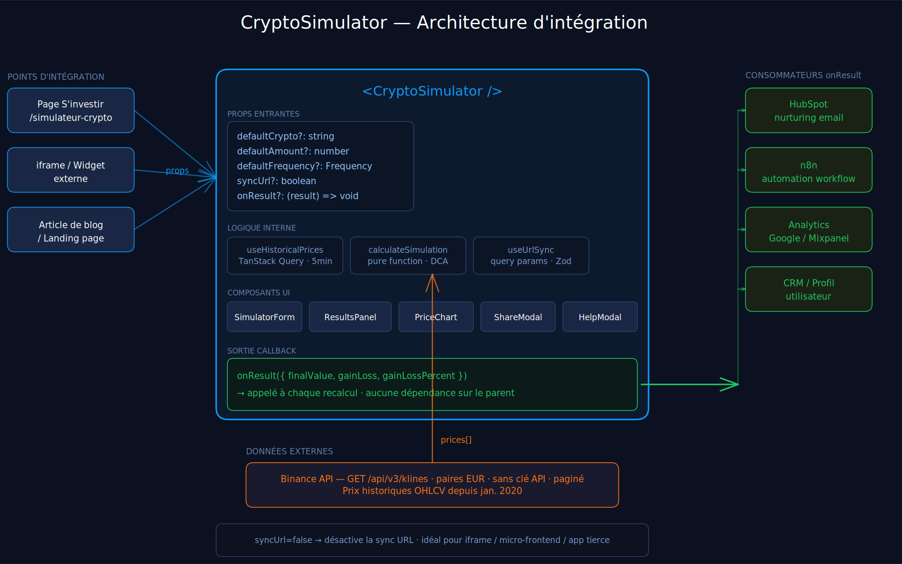

# Simulateur Crypto DCA — S'investir

Reproduction fidèle du simulateur crypto de [sinvestir.fr](https://sinvestir.fr) avec le design de [simulateurs.sinvestir.fr](https://simulateurs.sinvestir.fr).

## Démo

→ [simulateur-crypto-sinvestir-pied.vercel.app](https://simulateur-crypto-sinvestir-pied.vercel.app/simulateur-crypto)

## Lancer le projet

```bash
# Installer les dépendances
npm install

# Démarrer en développement
npm run dev
# → http://localhost:3000/simulateur-crypto

# Build de production
npm run build && npm start
```

Aucune variable d'environnement requise. Les données historiques proviennent de l'API publique Binance, sans clé API.

## Fonctionnalités

- **Simulateur DCA** : investissement unique ou récurrent (mensuel, hebdomadaire, quotidien)
- **+7 000 cryptos** : recherche par nom avec suggestions instantanées
- **KPI cards** : capital final, plus-value (€ et %), tokens acquis, prix moyen d'achat, somme investie
- **2 graphiques interactifs** : Historique (valeur / investi / prix / tokens acquis sur double axe) et Gains/Pertes (zone verte/rouge dynamique)
- **Légendes filtrables** : clic sur chaque série pour l'afficher ou la masquer
- **Barre de zoom** : range slider custom avec sparkline pour zoomer sur une sous-période
- **Partage enrichi** : modal de partage avec preview des résultats + Twitter/X, LinkedIn, WhatsApp, copie du lien
- **Partage par URL** : tous les paramètres encodés dans l'URL, simulation restaurée automatiquement
- **Modal d'aide** : guide contextuel accessible via le bouton flottant `?`
- **Composant embarquable** : `<CryptoSimulator />` autonome, configurable par props, sans store global
- **Design S'investir** : dark theme, sidebar fixe, typographie, couleurs fidèles au site de référence

## Composant embarquable — `<CryptoSimulator />`

Le simulateur est conçu pour être **intégré dans n'importe quelle page ou application React** avec un minimum de dépendances. Toute la logique (fetch, calcul, état) est encapsulée dans un seul composant.

```tsx
import { CryptoSimulator } from "@/components/simulator/CryptoSimulator";

// Usage minimal — l'utilisateur configure tout lui-même
<CryptoSimulator />

// Pré-configuré — idéal pour un article de blog ou une landing page dédiée
<CryptoSimulator
  defaultCrypto="BTC"
  defaultAmount={100}
  defaultFrequency="monthly"
/>

// Embarqué sans polluer l'URL (iframe, widget, page tierce)
<CryptoSimulator syncUrl={false} />

// Avec callback — pour connecter les résultats à un outil externe (CRM, analytics…)
<CryptoSimulator
  onResult={({ finalValue, gainLoss, gainLossPercent }) => {
    analytics.track("simulation_completed", { finalValue, gainLossPercent });
  }}
/>
```

### Props

| Prop | Type | Défaut | Description |
|---|---|---|---|
| `defaultCrypto` | `string` | — | Symbole crypto pré-sélectionné (`"BTC"`, `"ETH"`…) |
| `defaultAmount` | `number` | `100` | Montant d'investissement initial en € |
| `defaultFrequency` | `Frequency` | `"monthly"` | Fréquence : `"one-shot"`, `"daily"`, `"weekly"`, `"monthly"` |
| `syncUrl` | `boolean` | `true` | Synchronise l'état avec les query params URL (désactiver pour les iframes) |
| `onResult` | `function` | — | Callback appelé à chaque mise à jour des résultats |

### Diagramme d'architecture



### Pourquoi ce design ?

- **Aucun store global** — pas de Redux, pas de Zustand. L'état est local au composant.
- **Aucun context requis** — seul `ToastProvider` (déjà dans le layout) est nécessaire.
- **Données par props** — les valeurs par défaut et le comportement sont configurables sans modifier le composant.
- **Isomorphe** — `syncUrl={false}` permet l'intégration dans des contextes sans router (iframe, micro-frontend, application tierce).

## Architecture

```
src/
├── app/
│   ├── layout.tsx                      # Sidebar + ToastProvider + footer (layout stable)
│   ├── page.tsx                        # Dashboard
│   ├── simulateur-crypto/page.tsx      # Hero textuel + <CryptoSimulator syncUrl />
│   ├── simulateurs/page.tsx            # Catalogue des simulateurs
│   └── [autres routes]/               # Pages "en cours de développement"
├── components/
│   ├── layout/Sidebar.tsx              # Navigation fixe desktop + mobile collapsible
│   ├── simulator/
│   │   ├── CryptoSimulator.tsx         # ★ Composant embarquable (voir section ci-dessus)
│   │   ├── SimulatorForm.tsx           # Formulaire avec validation Zod
│   │   ├── ResultsPanel.tsx            # Chiffres clés (liste avec icônes)
│   │   ├── PriceChart.tsx              # Recharts (Historique + Gains/Pertes + légendes filtrables)
│   │   ├── ChartTooltips.tsx           # Tooltips custom extraits de PriceChart
│   │   └── RangeSlider.tsx             # Barre de zoom custom avec sparkline SVG
│   └── ui/
│       ├── Toast.tsx                   # Notifications top-right avec barre de progression
│       ├── HelpModal.tsx               # Modal guide d'utilisation
│       ├── ShareModal.tsx              # Modal partage (réseaux sociaux + copie lien)
│       └── ComingSoon.tsx              # Placeholder routes non implémentées
├── lib/
│   ├── api/binance.ts                  # Appels Binance + liste statique top cryptos
│   ├── calculations/simulator.ts       # Logique DCA pure (sans effet de bord)
│   ├── constants/index.ts              # Constantes centralisées (couleurs, délais, périodes)
│   ├── utils/formatters.ts             # Fonctions de formatage partagées (€, tokens, dates)
│   └── validators/simulator.ts         # Schéma Zod des inputs
└── hooks/
    ├── useHistoricalPrices.ts          # TanStack Query v5 (cache + loading states)
    └── useUrlSync.ts                   # Sérialisation/lecture des params URL
```

## Partis pris techniques

**Pas de backend custom.** La logique de calcul DCA est entièrement client-side (`src/lib/calculations/simulator.ts`). Données historiques via l'API publique Binance (pas de limite de taux en lecture). Ce choix permet un déploiement purement statique sur Vercel sans infra supplémentaire.

**TanStack Query v5 pour le cache API.** Les prix historiques sont mis en cache 5 minutes. Si l'utilisateur modifie un paramètre puis revient à la même période, aucun appel réseau supplémentaire n'est déclenché.

**Zod sur tous les inputs.** Le schéma `simulatorSchema` valide les paramètres formulaire ET les query params URL. Un lien partagé avec des valeurs corrompues ne peut pas provoquer d'erreur silencieuse.

**Layout stable entre navigations.** La `Sidebar` est dans le `RootLayout` Next.js App Router — elle ne se remonte pas lors des changements de route, ce qui évite les re-renders inutiles et préserve l'état (menu ouvert/fermé).

**URL sharing first.** La simulation est immédiatement partageable dès qu'une valeur change (`pushToUrl` à chaque `onChange`). Le lien peut être envoyé, bookmarké ou intégré sans action supplémentaire de l'utilisateur.

## Ce que j'aurais fait avec plus de temps

**Fonctionnalités produit**

- **Mode comparaison** : même période, deux cryptos ou deux stratégies DCA côte à côte — fort signal pédagogique pour les utilisateurs hésitants
- **Benchmark automatique** : superposer la performance crypto vs CAC40 ou S&P500 sur la même période
- **Inflation-adjusted returns** : afficher la plus-value en euros constants, plus honnête pour les longues périodes

**Technique**

- **Tests unitaires** sur `calculateSimulation` — la logique est déjà une pure function, les tests s'écrivent en 30 minutes
- **Route API Next.js** pour proxifier Binance et masquer l'origine des requêtes côté client
- **next-intl** pour l'internationalisation (EN/FR) — structuré pour être ajouté sans réécriture

**Intégration S'investir**

- **Automation n8n + HubSpot** : déclencher une séquence email nurturing adaptée au profil simulé (ex : DCA Bitcoin 5 ans → séquence "investisseur long terme")
- **Vue patrimoine consolidée** : combiner simulateur crypto + intérêts composés + immobilier dans un tableau de bord unique
- **Notifications de suivi** : "reviens voir ta simulation dans 6 mois" — engagement long terme des utilisateurs

## Stack

| Outil              | Version         | Usage           |
| ------------------ | --------------- | --------------- |
| Next.js            | 16 (App Router) | Framework       |
| React              | 19              | UI              |
| TypeScript         | 5               | Typage strict   |
| Tailwind CSS       | v4              | Styles          |
| Recharts           | 3               | Graphiques      |
| Zod                | 4               | Validation      |
| TanStack Query     | 5               | Cache API       |
| Husky + commitlint | —               | Qualité commits |
